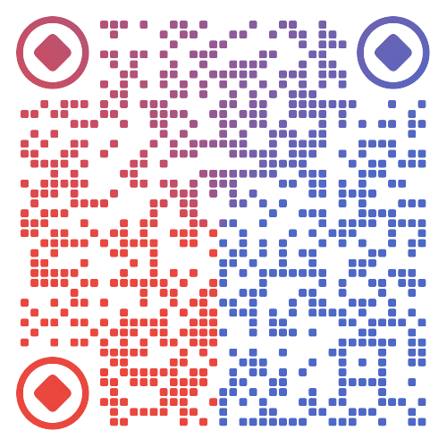

# LangGraph实战：Claude Code核心功能实现

使用 LangGraph (Python) 框架复现 Claude Code 核心功能模块的实战教程，通过代码实现帮助开发者深入理解其架构设计与工作原理。

## 💡 为什么要学习本课程？

1. **探索原理** - 解密强大的 coding agent 背后的实现机制
2. **迁移能力** - 掌握可复用的架构模式和设计方法论，应用于其他 Agent 场景
3. **精通使用** - 深入理解内部原理，更高效地发挥 Claude Code 的能力

**说明：** 本项目基于 LangGraph 实现 Claude Code 的核心功能，用于教学目的。由于技术栈差异，本项目是功能模块层面的复现，而非对 Claude Code 源码的逐行还原。

本课程参考了[《基于 LangGraph 一步步实现 Claude Code 核心设计》](https://developer.aliyun.com/article/1683352)和 shareAI-lab 的[《Claude Code 逆向分析》](https://github.com/shareAI-lab/analysis_claude_code)，并在 Claude Code 的协助下完成开发。

> 📍 **课程定位**：本系列为**基础到进阶篇**，涵盖 Claude Code 的核心功能模块。更多**生产级高级特性**（工具并发调用、安全验证、真实 Steering 实现、案例开发等）将在后续的**高级篇**中推出。
---

## 👥 适合人群

本课程适合：
- 🎓 想深入理解AI Agent原理的开发者
- 🔧 需要开发类似Claude Code应用的工程师
- 📚 学习LangGraph框架最佳实践的学习者
- 🤖 对multi-agent系统感兴趣的研究者

### 前置知识

**必需：**
- ✅ Python基础（熟悉async/await）
- ✅ 了解LLM的基本概念
- ✅ 有一定的Jupyter使用经验

**加分项：**
- 了解ReAct框架
- 使用过Langgraph
- 有Agent开发经验

> ⚠️ **异步编程提醒**：本课程的 Agent 开发涉及**大量异步编程**（async/await、asyncio、Task、事件循环等）。如果你对 Python 异步编程不熟悉，**强烈建议**先学习补充教程 `supp2_async_programming_tutorial.ipynb`，它提供了完整的异步编程知识体系，包括：
> - 协程（Coroutines）与 async/await 语法
> - asyncio 模块详解（gather、create_task、wait 等）
> - 事件循环机制
> - 异步迭代器和上下文管理器
> - 同步原语（Lock、Semaphore、Event、Queue）
> - 实战案例和最佳实践
>
> 掌握异步编程将帮助你更好地理解 LangGraph 的流式输出、并发控制、SubAgent 调度等核心机制。


## 📚 教学大纲

### ✅ 已完成章节（完整可运行）

#### 1. **第1章：基础ReActAgent** (`01_basic_react_agent.ipynb`)
   - ✅ StateGraph、MessagesState、ToolNode基础
   - ✅ 手动构建 vs 预构建Agent对比
   - ✅ 工具调用完整流程
   - ✅ 图结构可视化
   - ✅ 3个实战测试用例

#### 2. **第2章：人在环路** (`02_human_in_the_loop.ipynb`)
   - ✅ interrupt()中断机制详解
   - ✅ Command动态路由
   - ✅ MemorySaver状态持久化
   - ✅ 硬编码审查 vs LLM驱动审查
   - ✅ 时间旅行（状态回溯）
   - ✅ 生产环境建议

#### 3. **第3章：SubAgent实现** (`03_subagent_implementation.ipynb`)
   - ✅ SubAgent配置与创建
   - ✅ TaskTool工具设计
   - ✅ 3种专用SubAgent（通用/代码分析/文档撰写）
   - ✅ 上下文隔离演示
   - ✅ 工具过滤机制
   - ✅ 完整多Agent协作示例

#### 4. **第4章：TodoList任务管理** (`04_todo_task_management.ipynb`)
   - ✅ State扩展（添加todo_list）
   - ✅ TodoRead/TodoWrite工具
   - ✅ 提示词工程详解
   - ✅ LLM自主任务管理
   - ✅ 复杂任务自动分解演示

#### 5. **第5章：上下文压缩** (`05_context_compression.ipynb`)
   - ✅ Token监控机制（倒序查找优化）
   - ✅ 92%阈值智能触发
   - ✅ 8段式压缩提示词（完整版）
   - ✅ 压缩节点设计与实现
   - ✅ 消息保留策略
   - ✅ 长对话模拟测试

#### 6. **第6章：流式输出和中断** (`06_streaming_steering.ipynb`)
   - ✅ 三种stream_mode详解（values/updates/messages）
   - ✅ 事件级别流式输出（astream_events）
   - ✅ 实时Token流式输出
   - ✅ 异步流式处理（astream）
   - ✅ 中断与恢复演示
   - ✅ 流式进度追踪
   - ✅ Steering demo演示
   - ✅ 真实Steering实现方案

#### 7. **综合实战：claude_code_demo** (`claude_code_demo/`)
   - ✅ 集成所有6章核心功能
   - ✅ 模块化设计（core/tools/nodes/utils/prompts）
   - ✅ 多种运行方式（独立运行/模块导入/调试）
   - ✅ 完整示例代码


**说明：**  
1. 前6章notebook专注于教学，逐步讲解每个功能的原理与实现
2. `claude_code_demo`则是一个可直接使用的完整应用，展示如何将所有功能模块整合成综合Agent应用项目
3. 对于想要深入了解本教程实现与claude code真实实现差距的读者，可以参考补充资料`supp1_from_course_to_production.md`
4. 对于复杂的功能模块，使用更强大的模型，例如gpt-5-mini

---

### 🚧 规划中章节（高级篇）

以下高级特性正在开发中，将作为独立的高级课程推出：

#### **工具系统优化**
- 🔄 工具并发调用机制
- 🎯 智能工具选择与路由
- ⚡ 工具执行性能优化

#### **安全与控制**
- 🔒 工具权限与沙箱机制
- ✅ 输入输出安全验证
- 🛡️ 恶意代码检测与防护

#### **生产级特性**
- 🎮 真实 Steering 实现（完整架构）
- 📊 监控、日志与可观测性
- 🔧 错误处理与降级策略
- 💾 分布式状态管理

#### **高级交互**
- 🌐 MCP（Model Context Protocol）集成
- 🔌 插件系统设计

**关注本项目获取更新通知！** ⭐

---

## 🛤️ 学习路径

### 推荐学习顺序 ⭐

**阶段一：基础入门**
- **第1章**：基础ReAct Agent - 理解LangGraph核心概念
- **第2章**：人在环路 - 掌握中断和状态管理

**阶段二：进阶功能**
- **第3章**：SubAgent实现 - 多Agent协作
- **第4章**：TodoList任务管理 - LLM自主任务分解

**阶段三：性能与优化**
- **第5章**：上下文压缩 - 长对话管理
- **第6章**：流式输出和中断 - 用户体验与控制

**阶段四：综合实战**
- **claude_code_demo**：完整工程化实现 - 学习模块整合与生产级实践

**阶段五：深入理解**
- **supp1**：从课程到生产 - 完整技术对比与升级路径
  - 📖 理解课程实现 vs 真实 Claude Code 的差距
  - 🎯 掌握核心原理和工程优化的区别
  - 🚀 获得从教学Demo到生产系统的清晰路径


---

## 🚀 快速开始

### 环境准备

```bash
# 1. 安装依赖
# 方式一：
pip install -r requirements.txt

# 方式二：（推荐）：
uv venv

# Linux/Mac:
source .venv/bin/activate

# Windows:
.venv\Scripts\activate

uv pip install -r requirements.txt

# 2. 设置API Key（选择其一）
# Linux/Mac:
export OPENAI_API_KEY="your-key-here"
# 或使用通义千问
export DASHSCOPE_API_KEY="your-key-here"

# Windows (CMD):
set OPENAI_API_KEY=your-key-here
# 或
set DASHSCOPE_API_KEY=your-key-here

# Windows (PowerShell):
$env:OPENAI_API_KEY="your-key-here"
# 或
$env:DASHSCOPE_API_KEY="your-key-here"

# 3. （可选）启用LangSmith追踪
# Linux/Mac:
export LANGSMITH_API_KEY="your-key"
export LANGSMITH_TRACING="true"

# Windows (CMD):
set LANGSMITH_API_KEY=your-key
set LANGSMITH_TRACING=true

# Windows (PowerShell):
$env:LANGSMITH_API_KEY="your-key"
$env:LANGSMITH_TRACING="true"
```

### 运行示例

```bash
# 启动Jupyter
jupyter notebook

# 或使用VS Code的Jupyter扩展
code .
```

---

## 🎯 学习目标

完成本系列教程后，你将能够：

**理论层面：**
- ✅ 深入理解LangGraph的核心概念（StateGraph、MessagesState、Checkpointer）
- ✅ 掌握ReAct Agent的工作原理和实现方式
- ✅ 理解人机协同和中断机制的设计思路
- ✅ 了解multi-agent系统的架构设计

**实践能力：**
- ✅ 构建基础ReAct Agent
- ✅ 实现人机协同机制（interrupt、Command）
- ✅ 创建多Agent协作系统（SubAgent、工具过滤）
- ✅ 管理复杂任务流程（TodoList、状态管理）
- ✅ 优化上下文和性能（压缩、流式输出）
- ✅ 实现基础的中断控制（Steering demo）

**工程化能力：**
- ✅ 理解Claude Code的核心架构设计
- ✅ 掌握Agent开发的最佳实践
- ✅ 具备开发类似应用的基础能力

> 💡 **进阶提示**：想要掌握工具并发、安全验证、生产级Steering等高级特性？请关注后续的**高级篇**课程！

---

## 💻 代码特点

每个notebook都包含：

**完整性：**
- ✅ **完整可运行代码** - 所有import和配置，开箱即用
- ✅ **实际测试用例** - 可直接运行查看效果
- ✅ **图结构可视化** - 清晰展示Agent流程

**教学质量：**
- ✅ **详细中文注释** - 每个函数都有说明，理解无障碍
- ✅ **循序渐进讲解** - 从"是什么"到"为什么"再到"怎么做"
- ✅ **原理对比分析** - 与Claude Code原始实现对照
- ✅ **练习题巩固** - 每章都有思考题和练习

**灵活性：**
- ✅ **双LLM支持** - OpenAI和通义千问可切换
- ✅ **模块化设计** - 每章独立，可按需学习
- ✅ **完整demo实现** - claude_code_demo可直接使用和扩展

---


### 补充教程
- **`supp1_from_course_to_production.md`** - 课程内容 vs Claude Code 完整技术对比
- **`supp2_async_programming_tutorial.ipynb`** - Python 异步编程完整教程
- **`claude_code_demo/`** - 各种功能模块整合demo

### 外部资源
- [LangGraph官方文档](https://langchain-ai.github.io/langgraph/)
- [LangChain Python文档](https://python.langchain.com/)
- [Claude Code逆向分析](https://github.com/shareAI-lab/analysis_claude_code)

---

## ❓FAQ

### 1. Agent执行过程失败

更换更强大的LLM。对于复杂的任务，例如todo_task和context_compression，很多顶流开源大模型达不到预期，测试中gpt-5-mini便宜稳定，基本都能通过。


## 💖 支持本项目

如果本课程对你有帮助，欢迎通过以下方式支持：

- ⭐ **Star 本项目** - 让更多人看到这个教程
- 🔄 **Fork 并改进** - 欢迎提交 PR 完善内容
- 📢 **分享推荐** - 分享给更多需要的朋友
- 💬 **反馈建议** - 提 Issue 帮助改进课程

如果觉得课程有价值，也可以请我喝杯咖啡 ☕

<div align="center">
  
  <p><i>扫码支持，感谢你的鼓励！</i></p>
</div>

---

## 📄 开源协议

本项目采用 [MIT License](LICENSE) 开源协议。

你可以自由地：
- ✅ 商业使用
- ✅ 修改代码
- ✅ 分发和再授权
- ✅ 私有使用

唯一要求：保留原始的版权声明和许可声明。

---

## 📮 反馈

如有问题或建议，欢迎提Issue！

Happy Learning! 🚀
